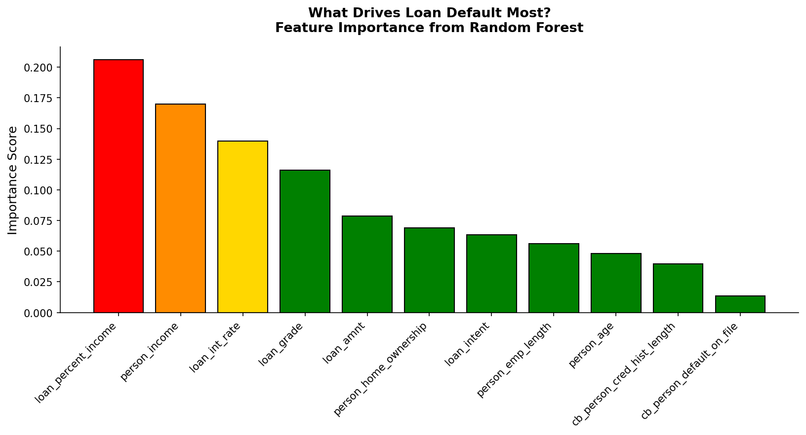
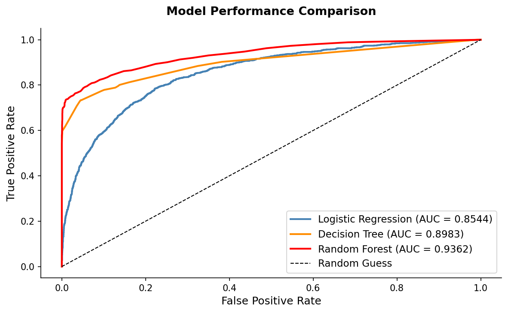
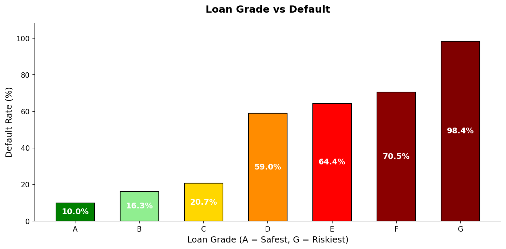
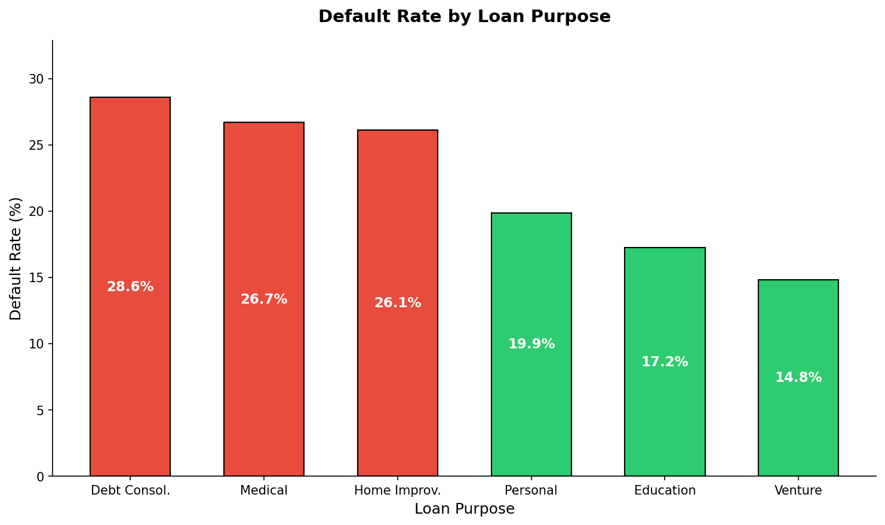
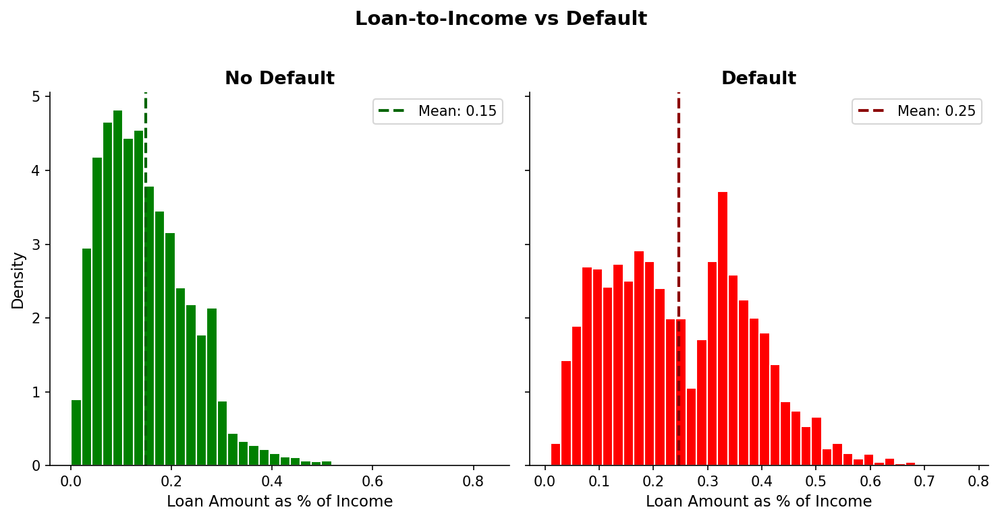
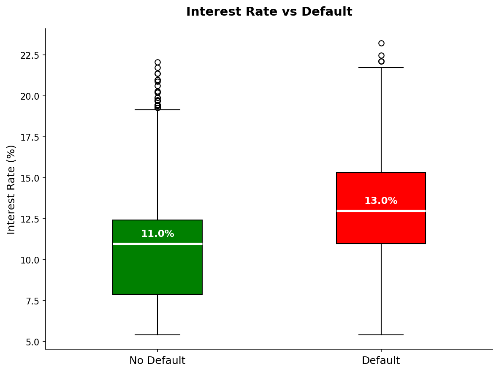
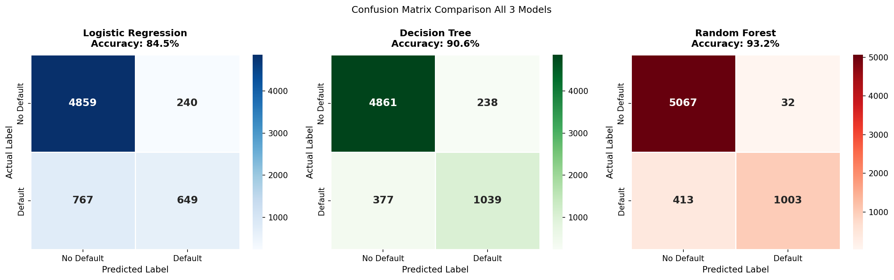

# Credit Risk Assessment: Predicting Loan Default with Machine Learning

## Overview
This project analyzes a dataset of 32,574 loan applications to predict whether a borrower will default on their loan. Using machine learning models, we identify key financial factors that contribute to loan default risk.

## Models Used
| Model | Accuracy | AUC |
|-------|----------|-----|
| Logistic Regression | 85% | 0.85 |
| Decision Tree | 91% | 0.90 |
| Random Forest | 93% | 0.94 ✅ Best |

## Key Findings
- Loan percent income is the strongest predictor of default
- Grade G borrowers default at 98.4%
- Defaulters borrow 25% of income vs 15% for non-defaulters
- Defaulters pay 13% interest vs 11% for non-defaulters
- Random Forest was the best performing model

## Dataset
- Source: Kaggle Credit Risk Dataset
- 32,574 observations, 12 features

## Files
- `Credit_Risk_Assessment_ML.ipynb` — Full analysis notebook
- `Credit Risk Assessment ML.ipynb - Colab.pdf` — PDF report
- `Project2.pptx` — Presentation slides

## Tools & Libraries
Python, Pandas, Scikit-learn, Matplotlib, Seaborn

## Visualizations

